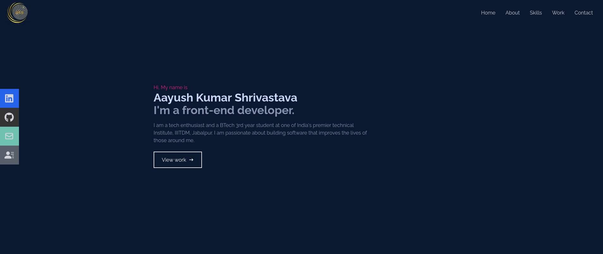
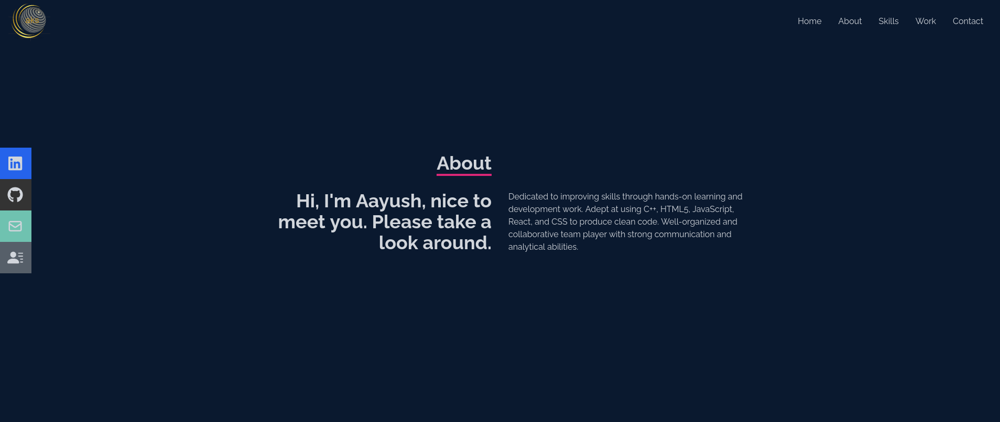
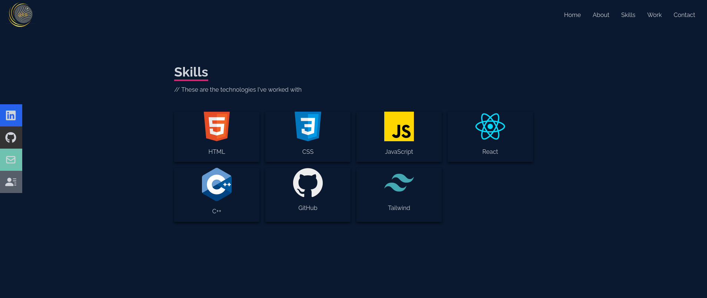
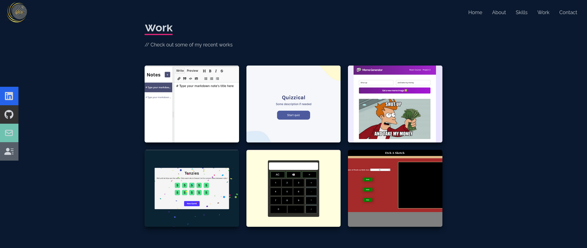
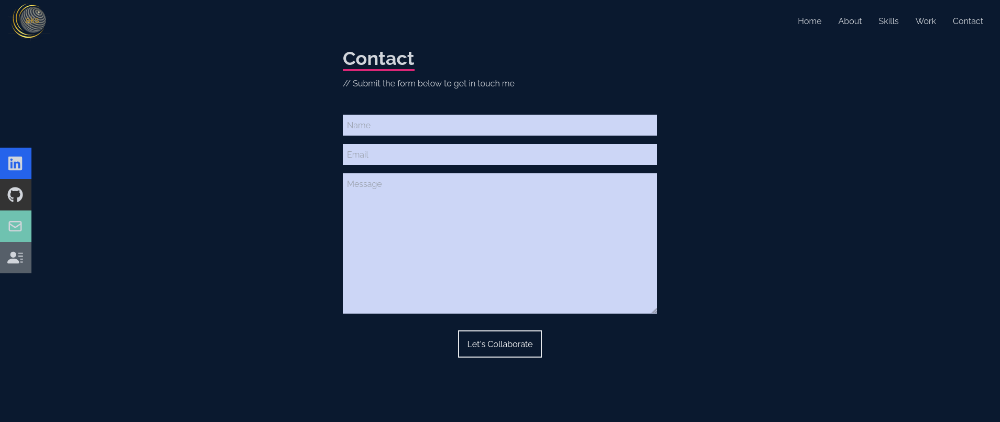

# Portfolio

This is my portfolio website, completely responsive on any device including desktops, mobiles, and tablets with various screen sizes. Using the header links on the navigation bar, viewers can easily jump between different sections on the page. My social handles are also available on the left side of the page. 
Deployed Link: 
It contains has 5 sections
## Home
 
## About

## Skills

This section displays my skills and the technologies I have worked with.
## Work

This section includes some of my recent projects with direct links to the the demo and the code.
## Contact

Using this section viewer can can contact me by filling and submitting the form.

## Technology and Tools Used
Create-React-App, JavaScript, Tailwind CSS, Getform.io(for collecting form submissions, and receiving emails)